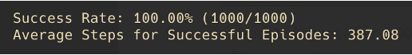
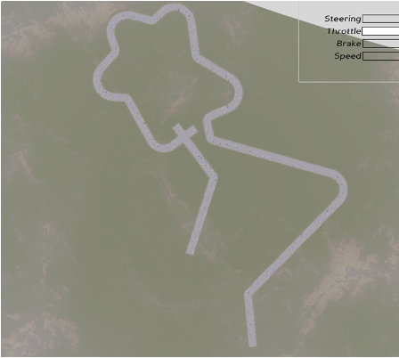
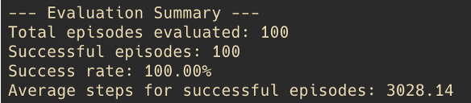
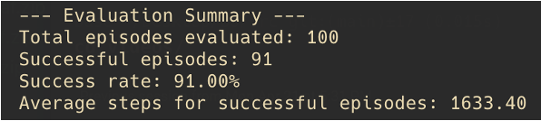
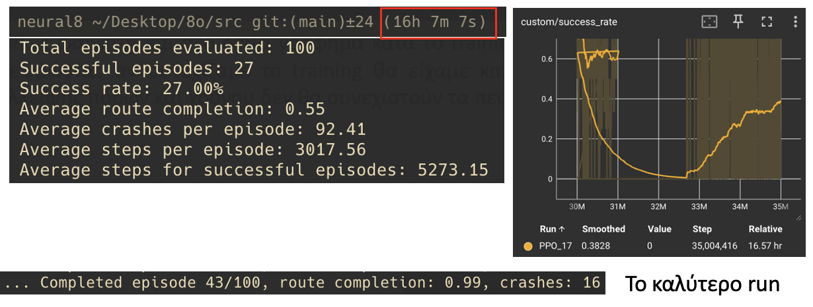

# Deep Reinforcement Learning for Autonomous Vehicles

This project applies Deep Reinforcement Learning (DRL) algorithms to autonomous vehicles (self-driving cars) using Python. The implementation utilizes Stable Baselines3 and/or PyTorch for training, along with the MetaDrive simulation environment.

## Overview

MetaDrive is an advanced open-source simulation environment specifically designed for developing and evaluating autonomous driving models. It's built on technologies like Panda3D and OpenAI Gym, enabling the creation of realistic and customizable driving environments.

## How to Run

### Setup:
Assuming you have a terminal with conda support:
1. Run the setup_env.sh file and then activate the environment with: `conda activate 1stProject4228`

Alternatively, if you prefer to install packages manually:
1. Install the packages listed in the requirements.txt file
2. Then, inside the metadrive folder (which contains the entire MetaDrive framework from GitHub), run: `pip install -e .`

Note: Python 3.10 is recommended, as testing was done on this version.

### Running experiments
After setup, verify that:
- You have activated the correct environment (`conda activate 1stProject4228`)
- You are inside the src folder

The src folder includes the following experiments (folders):
- StraightRoadAgent
- StraightCornerRoadAgent
- StraightCornerRoadPytorchAgent
- StraightCornerRoadPytorchAgent2
- ComplicatedMapAgent
- ComplicatedMapTrafficAgent
- CameraAgent

All experiments mentioned are those discussed throughout the project.

### How to Run an Experiment
1. `python {experiment_name}/eval.py`, if you want rendering
2. `python {experiment_name}/eval_no_render.py`, if you don't want rendering


## Initial Implementation

First, we studied the MetaDrive framework structure, leading to the creation of a customized environment class that inherits from MetaDrive's default environment. In this custom environment, specialized parameters were defined including configuration, reward functions, and sensors (Lidar (72), Side detector (20), lane line detector (20)) to meet specific training requirements.

The agent's training was initially conducted in a simple geometry environment—specifically an empty straight road—to familiarize it with basic driving principles. The Proximal Policy Optimization (PPO) algorithm was chosen as the training algorithm, implemented through the Stable Baselines3 library. The policy neural network architecture was defined with two hidden layers of 256 neurons each, using the Rectified Linear Unit (ReLU) activation function.

Training parameters included:
- Steps per update (n_steps): 4096
- Batch size: 256
- Learning rate: 1e-4
- Gamma coefficient: 0.99
- gae_lambda: 0.95
- clip_range: 0.2
- Entropy coefficient (ent_coef): 0.1 to enhance exploration
- vf_coef: 0.5
- Gradient clipping (max_grad_norm): 0.25

## Reward Function

The agent's reward function was initially designed with simplicity, incorporating a significant positive reward for completing the scenario without collision and a significantly negative reward in case of collision (which terminates the scenario). Additionally, vehicle speed was rewarded based on the formula:

```
Reward_speed = SpeedReward × (vehicle.speed / vehicle.max_speed)
```


Initial Agent at 10,000 steps


agent at  2,000,000 steps


Based on the initial experiment results, it was found that the agent learned to move toward the goal but exhibited non-smooth behavior, performing "slalom" type maneuvers. To improve driving stability, a revision of the reward function logic was required.

To achieve this goal, a new approach was developed that included checking the vehicle's position relative to the reference lane (the correct traffic area, defined by the four right lanes of the road). The distance traveled by the vehicle between two consecutive steps was then calculated based on global coordinates. The following component was incorporated into the previous reward function:

```
Reward_driving = d × StepDistance × positiveRoad
```

Where parameters `d` and `positiveRoad` correspond to reward weight coefficients and the indication of whether the vehicle is moving on the correct side of the road, respectively.


Updated agent after 3,000,000 steps


## Adding Turns

Next, the road geography was changed by adding two turns. Training a new agent with the same reward function architecture yielded interesting results. During training, the average reward was approximately 700, indicating that the agent completed the map. However, in evaluation where action selection is deterministic (the model selects the "most likely" action), the car repeatedly crashed at the first turn.

Further analysis revealed that during training, the agent reached a maximum speed of about 30 km/h, while in evaluation it reached up to 80 km/h. This is due to the PPO architecture's stochastic nature—the agent makes steering adjustments for exploration purposes. Due to friction, these continuous micro-corrections limit its speed. To reduce this difference between training and evaluation, the standard deviation (stochasticity) of the policy during training was reduced, making the model behave more similarly in both phases.





Updated agent after 3,000,000 steps

## PyTorch Implementation

Previously, the agent was trained with the Baseline3 framework. To gain a better understanding of how the PPO agent works "under the hood," the learning logic was rewritten exclusively with PyTorch. This provided better control over the training process with a more "low-level" knowledge of how the agent learns.

The code was divided into four main parts:
1. **Actor-Critic Network**: Implements an MLP that combines an actor (generates agent actions based on current policy) and a critic (estimates the value of each state)
2. **Rollout Buffer**: Stores agent experiences during training (observations, actions, log probabilities, rewards, value estimates)
3. **PPO Update Function**: Implements the PPO algorithm with clipped surrogate objective, value function loss, and entropy bonus
4. **Main Training Program**: Coordinates the overall training process (environment initialization, model, optimizer, experience collection, policy updates with PPO, metrics logging)

After implementation and several failed attempts with different parameters, the agent managed to complete the track with these parameters:

```python
total_steps = 3_000_000
buffer_size = 4096
learning_rate = 5e-5
gamma = 0.99  # Discount factor
lam = 0.95  # GAE lambda parameter
ppo_epochs = 10  # Number of PPO update epochs per rollout
ppo_batch_size = 256  # Minibatch size for PPO updates
ppo_clip_ratio = 0.3  # PPO clipping parameter
vf_coef = 0.3  # Value function loss coefficient
ent_coef = 0.0001  # Entropy bonus coefficient
grad_clip_norm = 0.5  # Gradient clipping norm
checkpoint_every = 100_000
log_std_init = -1.0  # Initial log standard deviation for policy
```

Results were considerably worse compared to the Baseline3 implementation, likely due to "unstable" training. This is evident from significant fluctuations in all graphs (even with smoothing), which is unexpected since the environment is relatively deterministic.


Updated agent after 3,000,000 steps

After extensive study and experimentation with different hyperparameters and reward functions, the results remained similar. Due to inability to identify the cause of instability, the training logic was revised with the following major changes:
- **Actor-Critic Separation**: Complete separation of Actor and Critic networks
- **Distribution Modeling**: Use of MultivariateNormal with full dispersion matrix (gas/steering)
- **Data Collection**: Multiple episodes collection for each update
- **Simplified Calculation**: Simpler advantage calculation without full GAE

When training the agent on the previous track using the new architecture and MetaDrive's default reward function, as well as various parameter combinations, I found that the architecture performed worse, as the agent couldn't even complete the track.

## Complex Track


In this chapter, an agent was trained to move on a complex track with traffic (other cars). The implementation was done with Baseline3 for reasons mentioned earlier (training stability).

Due to the complexity of the track, there was a need to redesign the reward function. The total reward for the vehicle is calculated as the sum of terms evaluating different aspects of driving:

1. **Speed Control Reward**:
   ```
   R₁ = c₁ × (1 - |v - v_target|/v_target)
   ```
   If the vehicle exceeds the desired speed, a penalty is applied:
   ```
   Penalty = -0.2 × (v - v_target), if v > v_target
   ```

2. **Route Progress Reward**:
   ```
   R₂ = c₂ × (L_now - L_last) × roadsign
   ```
   where L is position along the lane (longitudinal coordinate)

3. **Lane Center Deviation Penalty**:
   ```
   R₃ = -c₃ × |lat|/w
   ```
   where w is lane width and lat is lateral distance from lane center

4. **Direction Angular Deviation Penalty**:
   ```
   R₄ = -c₄ × |θ_diff|
   ```
   where θ_diff is the angle difference between vehicle direction and lane direction

5. **Smooth Driving**:
   ```
   R₅ = -c₅ × (|Δ_steering| + |Δ_throttle|)
   ```
   where Δ_steering is the absolute difference in steering angle from the previous step and Δ_throttle is the absolute difference in gas or brake from the previous step

6. **Termination Penalties**:
   - R₆ = +c₆, if the vehicle reaches its destination (success reward)
   - R₇ = -c₇, if the vehicle goes off-road (out-of-road penalty)
   - R₈ = -c₈, if there's a collision with another vehicle (crash penalty, doesn't terminate the simulation)

7. **Time Penalty**:
   - R₉ = -c₉, for each time step

The difficulty increased significantly with traffic and the complex track. For this reason, other cars were removed so the agent could learn the track without traffic.



Due to the previously defined reward function, the car maintained the first lane and moved at 40km/h. Training was repeated by removing R₁ and R₃, allowing the agent to move freely on the track.




The agent moved more dangerously in the second implementation, as evidenced by the Success rate, but completed the track much faster as shown in the Average steps for successful episodes.


## Adding Traffic

Adding traffic to the simulation dramatically reduced training time (1000it/s -> 60 it/s). Due to this condition, the previously pre-trained model was taken and retrained in traffic for just 5,000,000 steps, keeping all R except R₃ (for potential overtaking capability) with v_target = 75 km/h.



After several attempts changing the constants c of the reward function, the model with the most Success rate was achieved.

As shown in the right graph during training, the success rate had an upward trend, suggesting that continuing training would yield better results. Unfortunately, due to lack of resources and time, experiments in this environment were not continued.

## Important Notes

The MetaDrive environment provides the ability to create randomized maps (scenarios) or seed a specific map (during training), which would be a better approach so the environment isn't deterministic. This way, the agent wouldn't "overfit" to a specific stage but would learn to drive on any given track. This would require significant resources suggesting parallelism. Due to hardware limitations (Apple Silicon), parallelism was quite buggy with SubprocVecEnv and DummyVecEnv of Baseline3, which is why this specific approach was chosen.

## RGB Camera Input

In this section, the observation sensor was an RGB camera (along with vehicle states) which returns consecutive images. The implementation was done with PyTorch using much of the code discussed earlier in the PyTorch Implementation chapter.

### Model Architecture

The ActorCritic class combines:
- CNN for image processing, accepting 9-channel inputs (3 consecutive RGB) and extracting features through three convolutional layers
- Common Fully Connected layers - Combining visual features with additional vehicle state information, passing them to two MLP layers

Policy and Value Heads:
- Actor produces distribution parameters for actions
- Critic estimates the value of the current state

Training the agent with the same map (Complex track), environment, and reward function revealed that training is much more time-consuming (logical due to CNN) and "learning" is more difficult.

The run wanted to complete just 3,000,000 steps, with an average progress on the map of 14% (after the first turn).

Due to time constraints, training was run again with exactly the same parameters, environment, and reward function, with the only change being a simpler track with just 3 turns.


## Conclusions

The research revealed that the Stable Baselines3 architecture offers significantly more stable training compared to the custom PyTorch implementation, with a clear difference in convergence and overall performance. The design of the reward function played a critical role, where incorporating parameters such as driving smoothness and route progress significantly improved vehicle behavior.

A significant difference was also observed between training and evaluation phases, with the vehicle developing higher speeds during evaluation due to the non-stochastic nature of decisions. Adding traffic and complexity to the track dramatically increased computational requirements, while using an RGB camera as input proved significantly more demanding both computationally and in terms of convergence.

The work demonstrates the need for careful balance between environment complexity, reward function design, and computational resources for successful training of autonomous vehicles using deep reinforcement learning techniques.

